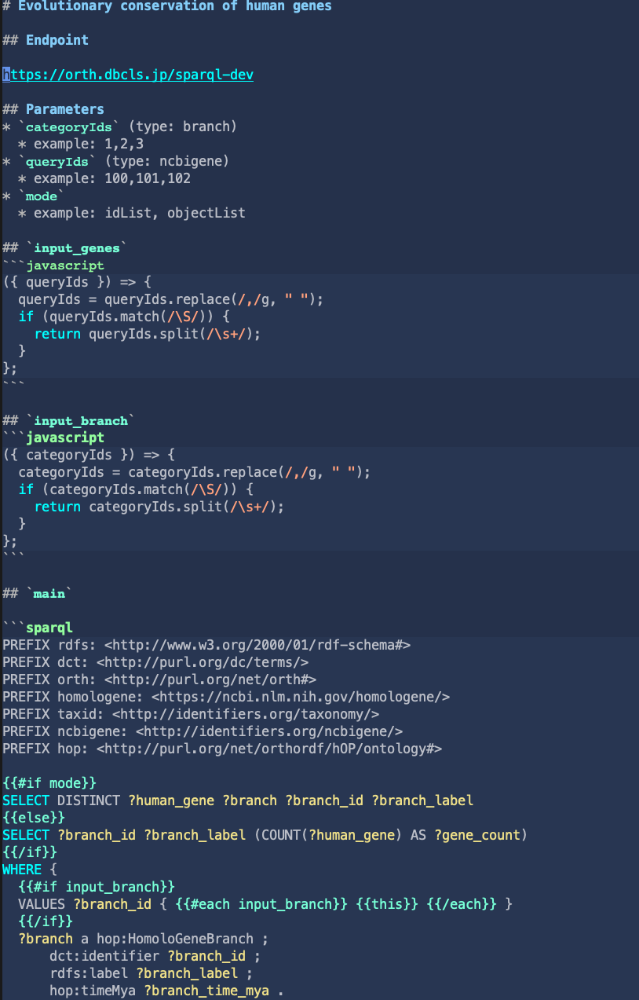

# sparqlet-run

https://github.com/dbcls/sparqlist の lib/\*.mjs を利用して、bin/sparqlet-run.mjs を作成しました.

(.mjs という拡張子は ES Modules という Node.js の新しい機能を利用していることを表しています)

## Example
```
$ sparqlet-run homologene_category.md
[
  {
    "categoryId": "1",
    "label": "human",
    "count": 172
  },
  ...
]
490 ms
```
パラメータ指定:
```
$ sparqlet-run homologene_category.md categoryIds=1
[
  {
    "categoryId": "1",
    "label": "human",
    "count": 172
  }
]
385 ms
```
エンドポイントを一時的に変えてみる:
```
$ sparqlet-run homologene_category.md -e https://integbio.jp/togosite/sparql
```
繰り返し実行(時間測定のみ):
```
$ sparqlet-run homologene_category.md -n 3
386 ms
304 ms
305 ms
```
テーブル形式で出力、カラムを揃える:
```
$ sparqlet-run homologene_category.md -c
```
ディレクトリ内のSPARQLetをすべて実行:
```
$ for file in *.md; echo $file; do sparqlet-run $file; done
```

## Install
Node.jsのv14.13.0以上が必要.
```
$ cd sparqlet-run
$ npm install
```
コマンドをパスに入れるため、続けて `$ npm link` (root権限が必要な場合は `$ sudo npm link`)

## Usage
```
$ ./bin/sparqlet-run.mjs
```
あるいは、`$ npm link` してあれば、
```
$ sparqlet-run
```

## Misc
Emacsに poly-markdown と https://github.com/hchiba1/sparql-mode を入れると、SPARQLetが編集しやすくなる.


