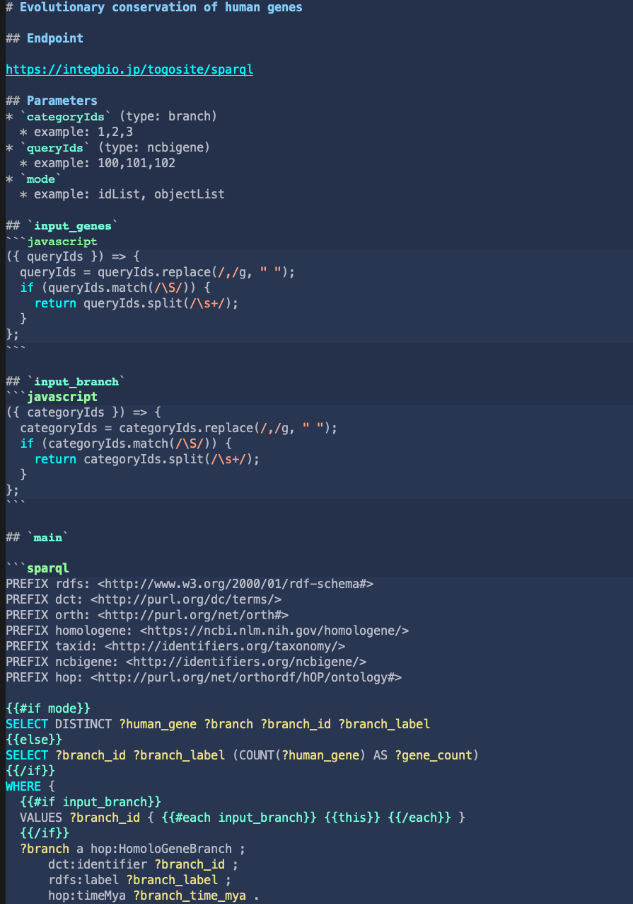

# sparqlet-run

https://github.com/dbcls/sparqlist の lib/\*.mjs を利用して、bin/sparqlet-run.mjs を作成しました.

(.mjs という拡張子は ES Modules という Node.js の新しい機能を利用していることを表しています)

## Example
```
$ sparqlet-run homologene_category.md
[
  {
    "categoryId": "1",
    "label": "human",
    "count": 172
  },
  ...
]
490 ms
```
パラメータ指定:
```
$ sparqlet-run homologene_category.md categoryIds=1
[
  {
    "categoryId": "1",
    "label": "human",
    "count": 172
  }
]
385 ms
```
エンドポイントを変えてみる:
```
$ sparqlet-run homologene_category.md -e https://integbio.jp/togosite/sparql
```
繰り返し実行(時間測定のみ):
```
$ sparqlet-run homologene_category.md -n 3
386 ms
304 ms
305 ms
```
テーブル形式で出力、カラムを揃える:
```
$ sparqlet-run homologene_category.md -c
```
ディレクトリ内のSPARQLetをすべて実行:
```
$ for file in *.md; echo $file; do sparqlet-run $file; done
```

## ターゲットエンドポイントを調べる
```
$ sparqlet-run homologene_category.md -s
https://integbio.jp/togosite/sparql   homologene_category
```
JavaScriptの中で、別のSPARQListを呼び出している場合
```
$ sparqlet-run refex_specific_high_expression.md -s
[
  'https://integbio.jp/togosite/sparqlist/api/refex_specific_expression'
]
```

## Togoサイト関連
Togoサイトのproperties.jsonで利用しているSPARQLetをリストアップ
```
$ sparqlet-ls
Ensembl_gene_type
Ensembl-exon-count
...
```

```
$ sparqlet-ls -v
[[Gene]]
Gene biotype    Ensembl_gene_type
# of exons      Ensembl-exon-count
...
```

さらに、各々のターゲットエンドポイントを調べる
```
$ for i in $(sparqlet-ls); do sparqlet-run $i.md -s; done
https://integbio.jp/togosite/sparql     Ensembl_gene_type
https://integbio.jp/togosite/sparql     Ensembl-exon-count
...
```

SPARQLetのタイトルも付けて表示する
```
$ sparqlet-ls -vt
```

Aggregate用SPARQLetのリストを取得
```
$ sparqlet-ls -A
```

メタスタンザ用の呼び出し部分を抽出
```
$ sparqlet-ls -M
```

TogoサイトSPARQListからSPARQLetを取得して、ローカルで実行してみる
```
$ sparqlet-api homologene_category
```
```
$ sparqlet-api --run homologene_category
```

GitHubからTogoSite用のSPARQLetを取得して、ローカルで実行してみる
```
$ sparqlet-run --github homologene_category
```

### パラメータexampleを利用したテスト
パターン2 (mode=idList categoryIds=...) のexampleを自動で埋め込んでテストする
```
$ sparqlet-run --p2 homologene_category.md
```

### 結果の検証
```
$ sparqlet-test homologene_category.md
```
実行結果と、homologene_category.txt を比較する

## Install
Node.jsのv14.13.0以上が必要.
```
$ cd sparqlet-run
$ npm install
```
コマンドをパスに入れるため、続けて `$ npm link` (root権限が必要な場合は `$ sudo npm link`)

## Usage
```
$ ./bin/sparqlet-run.mjs
```
あるいは、`$ npm link` してあれば、
```
$ sparqlet-run
```

## Misc
Emacsに poly-markdown と https://github.com/hchiba1/sparql-mode を入れると、SPARQLetが編集しやすくなる.


